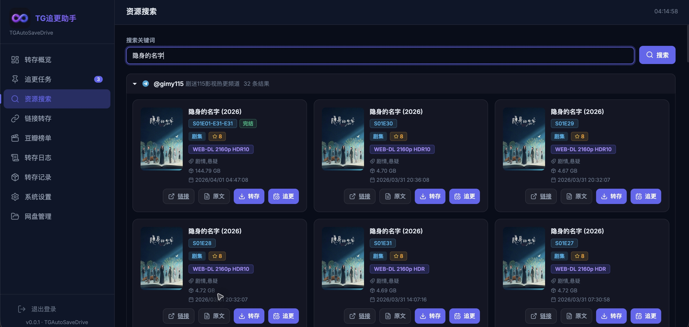
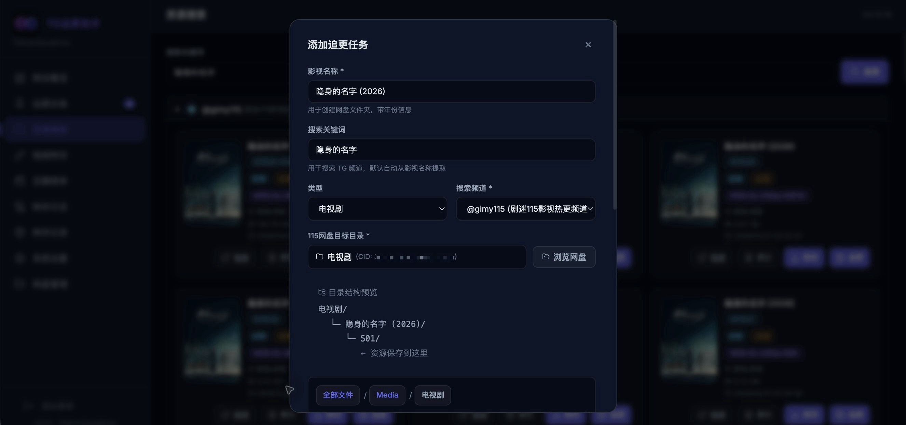
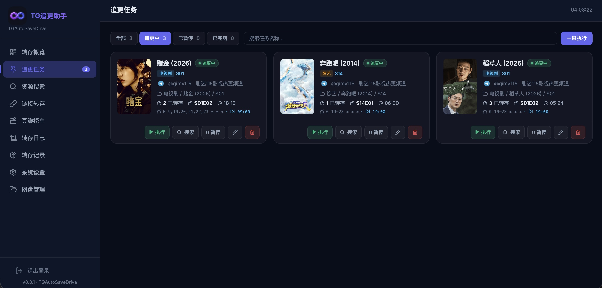

<a name="readme-top"></a>
<div align="center">


# TGAutoSaveDrive

**Telegram 频道 115 网盘追更转存系统**

自动监控 TG 频道资源 → 智能解析 → 一键转存 → 定时追更

[](./VERSION.md) [](https://hub.docker.com/r/ccc333i/tgautosavedrive) [](https://hub.docker.com/r/ccc333i/tgautosavedrive/tags) [](#技术栈) [](#许可说明) [](https://t.me/tgautosavedrive)

</div>

---

<details>
<summary><kbd>目录导航</kbd></summary>

- [✨ 核心特性](#-核心特性)
- [📸 界面预览](#-界面预览)
- [🚀 快速部署](#-快速部署)
- [⚙️ 环境变量](#️-环境变量)
- [📖 使用指南](#-使用指南)
- [🔗 联动配置](#-联动配置)
- [🛠️ 技术栈](#️-技术栈)
- [📜 许可说明](#-许可说明)

</details>

---

## ✨ 核心特性

### 📡 Telegram 频道搜索
支持 **HTTP 抓取** 和 **MTProto 协议** 双模式。MTProto 即时搜索，速度更快、结果更全；HTTP 模式零配置开箱即用。支持多频道管理、全量/增量扫描和本地缓存。

### 📅 自动追更
基于 **Cron** 的定时任务系统，支持电视剧持续追更、电影一次性转存。按剧名/季自动创建文件夹结构，智能去重（分享码 + 集信息 + 文件名三重校验），超期无新资源自动完结。

### 🎯 智能解析
内置消息解析逻辑，主要按作者个人使用场景优化，重点适配 **gimy115** 和 **QukanMovie** 两类频道格式。可自动提取剧名、年份、季集、画质、文件大小等元数据，并按画质排序保留候选资源；其他频道格式可能无法完整识别，不保证兼容。

### 🔐 115 网盘深度集成
支持扫码登录、文件浏览、目录管理、分享转存、离线下载全功能。

### 🔔 多渠道通知
转存成功后自动推送通知，支持 **PushPlus 微信** 和 **Telegram Bot** 双通道。30 秒防抖合并，多任务同时完成只发一条消息。

### 🎬 影视联动
- **SmartStrm**：转存后触发 Webhook，自动生成 STRM 文件
- **Emby**：SmartStrm 通知后延时触发媒体库扫描，资源即存即看
- **豆瓣榜单**：浏览热门新片，一键搜索转存

<div align="right">

[](#readme-top)

</div>

## 📸 界面预览

### 资源搜索



### 添加追更任务



### 追更任务列表



<div align="right">

[](#readme-top)

</div>

## 🚀 快速部署

使用 **docker-compose.yml** 部署（推荐）：

```yaml
name: tgautosavedrive
services:
  tgautosavedrive:
    image: ccc333i/tgautosavedrive:latest
    container_name: tgautosavedrive
    restart: unless-stopped
    ports:
      - "39977:39977"
    volumes:
      - ./data:/data
    environment:
      - DATABASE_URL=sqlite:////data/db/app.db
      - PORT=39977
      - DATA_DIR=/data
      - TZ=Asia/Shanghai
```

使用 **docker run** 部署：

```bash
docker run -d \
  --name tgautosavedrive \
  --restart unless-stopped \
  -p 39977:39977 \
  -v $(pwd)/data:/data \
  -e DATABASE_URL=sqlite:////data/db/app.db \
  -e PORT=39977 \
  -e DATA_DIR=/data \
  -e TZ=Asia/Shanghai \
  ccc333i/tgautosavedrive:latest
```

> [!TIP]
>
> 部署完成后，访问 `http://yourip:39977` 进入管理后台。
>
> 默认账号 `admin` / `admin`，请登录后立即修改密码。

<div align="right">

[](#readme-top)

</div>

## ⚙️ 环境变量

| 变量 | 默认值 | 说明 |
|------|--------|------|
| `DATABASE_URL` | `sqlite:////data/db/app.db` | SQLite 数据库路径 |
| `PORT` | `39977` | Web 服务端口 |
| `DATA_DIR` | `/data` | 数据目录（数据库/封面/TG Session） |
| `TZ` | `UTC` | 时区（推荐 `Asia/Shanghai`） |

## 📖 使用指南

### 简单四步，开始使用

1. **配置 Cookie**：在「基础设置」中扫码登录 115 网盘
2. **添加频道**：在「频道 & 账号」中添加 Telegram 公开频道，并执行全量扫描
3. **搜索资源**：在「资源搜索」中输入影视名称，从频道查找 115 分享资源
4. **一键追更**：找到资源后点击「追更」，系统自动创建定时任务

### 目录自动整理

系统按影视名称自动创建文件夹结构：

```
目标目录/
  └─ 八千里路云和月 (2026)/
    └─ S01/
      ← 资源自动保存到这里
```

- 电视剧/综艺：自动创建 `剧名(年份)/季文件夹`，持续追更直到完结
- 电影：直接放在 `片名(年份)` 目录下，一次性转存后自动标记完成

<div align="right">

[](#readme-top)

</div>

## 🔗 联动配置

### SmartStrm
转存成功后触发 SmartStrm Webhook，自动生成 STRM 文件。在「消息通知」中配置 Webhook URL 和任务名称。

### Emby
SmartStrm 通知后延时触发 `POST /Library/Refresh`，自动刷新媒体库。支持自定义延时（默认 180 秒）。

### 通知推送
| 渠道 | 说明 |
|------|------|
| PushPlus | 微信公众号推送，需配置 Token |
| Telegram Bot | TG 机器人推送，需配置 Bot Token + Chat ID |

## 🛠️ 技术栈

| 层次 | 技术 |
|------|------|
| 后端 | Go 1.25 · Gin · gocron/v2 · GORM + SQLite（modernc，无 CGO） |
| 前端 | Vue 3 CDN · 单文件 SPA · Lucide Icons |
| Telegram | HTTP scraping + MTProto（gotd/td） |
| 容器 | Docker Alpine · 单容器 · 端口 39977 |

<div align="right">

[](#readme-top)

</div>

## 📜 许可说明

TGAutoSaveDrive 是一个**闭源项目**，**永久免费**使用。

1. **项目性质**：本应用旨在通过程序自动化提高网络服务的使用效率，仅对已有 API 进行封装调用，不涉及任何破解行为。

2. **数据责任**：本应用所处理的数据均来源于第三方平台，开发者不对用户存储内容的合法性负责，用户应自行评估并承担由此产生的一切风险。

3. **使用限制**：本应用仅供个人学习与研究使用，禁止用于任何商业行为与非法用途。禁止未经授权的修改、分发或商业化。

版权所有 © 2026 TGAutoSaveDrive

<div align="right">

[](#readme-top)

</div>
