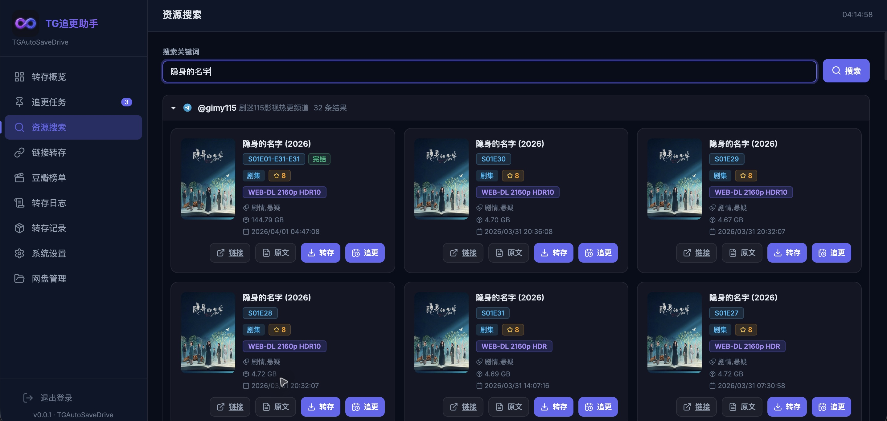
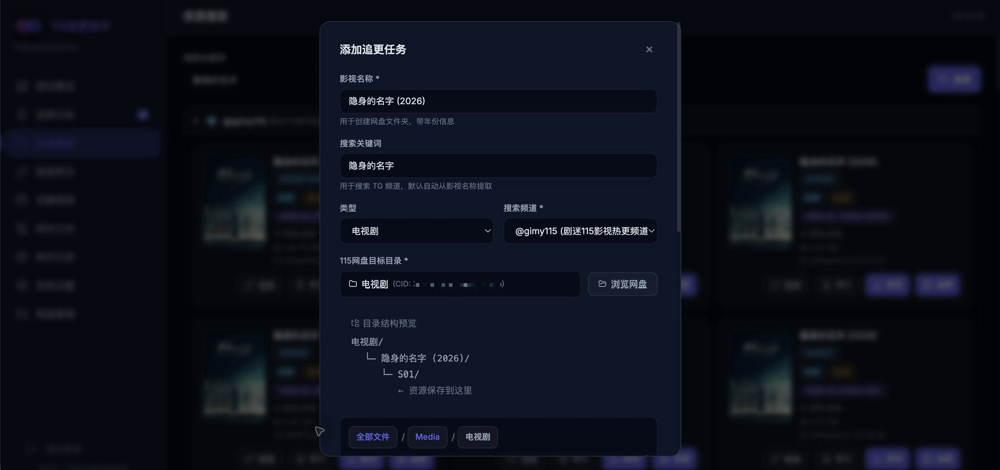
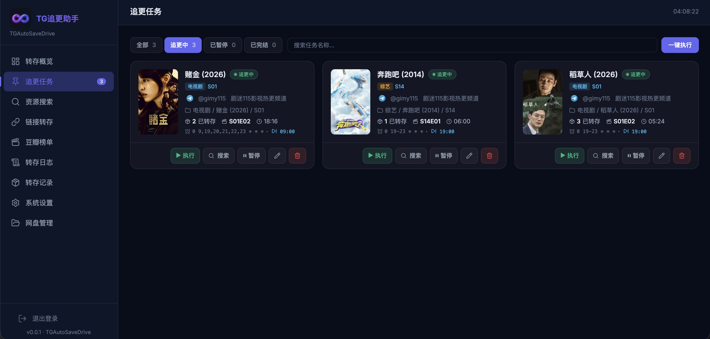

<a name="readme-top"></a>
<div align="center">


# TGAutoSaveDrive

**Telegram 频道 115 / 123 网盘追更转存系统**

自动监控 TG 频道资源 → 智能解析 → 一键转存 → 定时追更

**适用于 115 网盘和 123 云盘用户**

[](./VERSION.md) [](https://hub.docker.com/r/ccc333i/tgautosavedrive) [](https://hub.docker.com/r/ccc333i/tgautosavedrive/tags) [](#技术栈) [](#许可说明) [](https://t.me/tgautosavedrive)

</div>

---

<details>
<summary><kbd>目录导航</kbd></summary>

- [✨ 核心特性](#-核心特性)
- [📸 界面预览](#-界面预览)
- [🚀 快速部署](#-快速部署)
- [⚙️ 环境变量](#️-环境变量)
- [📖 使用指南](#-使用指南)
- [🔗 联动配置](#-联动配置)
- [🛠️ 技术栈](#️-技术栈)
- [📜 许可说明](#-许可说明)

</details>

---

## ✨ 核心特性

### 📡 Telegram 频道搜索
支持 **HTTP 抓取** 和 **MTProto 协议** 双模式。MTProto 即时搜索，速度更快、结果更全；HTTP 模式零配置开箱即用。支持多频道管理、全量/增量扫描和本地缓存。

### 📅 自动追更
基于 **Cron** 的定时任务系统，支持电视剧持续追更、电影一次性转存。内置电影/综艺/动漫/电视剧/纪录片 5 种类型。按剧名/季自动创建文件夹结构，智能去重（分享码 + 集信息 + 文件名三重校验），超期无新资源自动完结。

### 🎯 智能解析

内置消息解析逻辑，可提取剧名、年份、季集、画质、文件大小等元数据，并按画质排序保留候选资源。当前重点适配以下频道：

| 频道 | 网盘 | 适配说明 |
|------|------|----------|
| [**regeng115**](https://t.me/regeng115) | 115 | **v0.0.30 新增**：ED2K 视频链接，支持搜索、缓存、追更和订阅 |
| [**gimy100**](https://t.me/gimy100) | 115 | **v0.0.30 新增**：ED2K 视频、Telegraph 链接清单及视频分享候选 |
| [**QukanMovie**](https://t.me/QukanMovie) | 115 | 115 分享资源格式 |
| [**regeng123**](https://t.me/regeng123) | 123 | 123 分享资源格式；123 云盘仅适配此频道 |

感谢频道主的资源分享！请仅处理自己拥有相应权利的内容。频道需在「频道 & 账号」中自行添加。

> ⚠️ 本项目不会适配 `yingshiziyuanpindao`（星河频道）的消息格式，原因请自行了解。其他未适配频道的消息格式可能无法完整识别。

### 🔐 115 网盘深度集成
支持扫码登录、文件浏览、目录管理、分享转存、离线下载全功能。

### ED2K 下载与自动归档

搜索、追更和订阅支持 115 ED2K 视频任务及 Telegraph 清单。纯 ED2K 资源直接进入云下载队列；同时存在可用视频分享时优先分享，仅确认分享失效后回退 ED2K，字幕链接不作为视频候选。只处理视频文件，不下载独立字幕。

视频先下载到根目录「云下载」，下载完成后移动至对应影片/剧集目录，并验证归档结果。只有归档成功后才发送成功通知和触发 SmartStrm、Emby；开启时间标记的剧集追更会先更新时间标记。支持逐文件进度、失败提醒、手动重试和重启恢复。

### ☁️ 123 云盘支持
支持 123 云盘网盘管理、资源转存、追更任务全链路。仅适配 [@regeng123](https://t.me/s/regeng123) 频道资源格式。

### 🔔 多渠道通知
转存成功后自动推送通知，支持 **PushPlus 微信** 和 **Telegram Bot** 双通道。30 秒防抖合并，多任务同时完成只发一条消息。

受管 ED2K 任务检测到下载或归档失败时会发送需处理提醒；通知渠道需启用并配置有效凭据。任务状态与错误也可在「转存记录 → 云下载任务」查看。

### 🎬 影视联动
- **SmartStrm**：转存后触发 Webhook，自动生成 STRM 文件。支持电影/综艺/动漫/电视剧/纪录片 5 种类型映射，每种类型可配置多个任务名（逗号分隔）
- **Emby**：SmartStrm 通知后延时触发媒体库扫描，资源即存即看
- **豆瓣榜单**：浏览热门新片，一键搜索转存

<div align="right">

[](#readme-top)

</div>

## 📸 界面预览

### 资源搜索



### 添加追更任务



### 追更任务列表



<div align="right">

[](#readme-top)

</div>

## 🚀 快速部署

使用 **docker-compose.yml** 部署（推荐）：

```yaml
name: tgautosavedrive
services:
  tgautosavedrive:
    image: ccc333i/tgautosavedrive:latest
    container_name: tgautosavedrive
    restart: unless-stopped
    ports:
      - "39977:39977"
    volumes:
      - ./data:/data
    environment:
      - DATABASE_URL=sqlite:////data/db/app.db
      - PORT=39977
      - DATA_DIR=/data
      - TZ=Asia/Shanghai
```

使用 **docker run** 部署：

```bash
docker run -d \
  --name tgautosavedrive \
  --restart unless-stopped \
  -p 39977:39977 \
  -v $(pwd)/data:/data \
  -e DATABASE_URL=sqlite:////data/db/app.db \
  -e PORT=39977 \
  -e DATA_DIR=/data \
  -e TZ=Asia/Shanghai \
  ccc333i/tgautosavedrive:latest
```

> [!TIP]
>
> 部署完成后，访问 `http://yourip:39977` 进入管理后台。
>
> 默认账号 `admin` / `admin`，请登录后立即修改密码。

<div align="right">

[](#readme-top)

</div>

## ⚙️ 环境变量

| 变量 | 默认值 | 说明 |
|------|--------|------|
| `DATABASE_URL` | `sqlite:////data/db/app.db` | SQLite 数据库路径 |
| `PORT` | `39977` | Web 服务端口 |
| `DATA_DIR` | `/data` | 数据目录（数据库/封面/TG Session） |
| `TZ` | `UTC` | 时区（推荐 `Asia/Shanghai`） |

## 📖 使用指南

### 简单四步，开始使用

1. **配置 Cookie**：在「基础设置」中扫码登录 115 网盘
2. **添加频道**：在「频道 & 账号」中添加 Telegram 公开频道，并执行全量扫描
3. **搜索资源**：在「资源搜索」中输入影视名称，查找 115 分享、ED2K 或已适配的 123 分享资源
4. **一键追更**：找到资源后点击「追更」，系统自动创建定时任务

### 目录自动整理

系统按影视名称自动创建文件夹结构：

```
目标目录/
  └─ 八千里路云和月 (2026)/
    └─ S01/
      ← 资源自动保存到这里
```

- 电视剧/综艺：自动创建 `剧名(年份)/季文件夹`，持续追更直到完结
- 电影：直接放在 `片名(年份)` 目录下，一次性转存后自动标记完成

### v0.0.31 升级与 ED2K 使用说明

1. 升级前备份数据目录。升级后登录 Web，在「频道 & 账号」添加 `regeng115`、`gimy100`，网盘类型选 115。
2. 若尚未完成 v0.0.30 的 ED2K 缓存升级，按提示点击「开始全量补扫」，完整补扫所有已配置频道一次。已完成补扫的用户无需为 v0.0.31 重扫。频道缓存扫描本身不触发下载、通知或媒体库扫描。
3. **不会在打开网页时自动启动补扫**。可选择「稍后处理」；中断后点击「继续全量补扫」，沿已保存断点继续。旧缓存保留，日常增量更新继续运行。
4. 从搜索结果转存，或创建追更/订阅任务后，在「转存记录 → 云下载任务」查看进度。ED2K 是逐文件任务，电影即使只有一个文件也会自动创建影片目录。
5. 普通下载失败后依次等待 **1、6、24 小时**重新添加，最多自动重建 **3 次**；连续 **24 小时无进展**也会触发重建，有进展则重新计时。账号、空间、配额等限制暂停并提醒，处理后手动重试。页面显示次数、下次时间，并提供「立即重新添加」「停止自动处理」。旧版已停止的失败任务可手动重新添加。
6. 时间标记沿用原有开关、目录规则和根目录 `时间标记.txt` 模板；一次性转存不创建追更时间标记。模板缺失等错误单独记录，不回滚已归档视频。

自动重建仅删除本系统对应的下载记录，**不删除网盘文件**。删除前重新确认下载状态，确认记录消失后才重新添加原 ED2K 链接。下载完成、存入网盘或归档中的任务不重建；已下载但移动失败时只重试归档。归档按文件 ID、类型及所在目录确认，不用文件名或显示大小拦截；目录同步延迟可自动复查 15 分钟。

提交、删除超时等结果不明确的情况先核实，超过 10 分钟仍无法确认时提示人工处理，不盲目重复请求。已有相同云下载任务不会被自动接管；停止自动处理不会删除远端任务或文件。失败、等待或重新添加中的视频不会触发时间标记、成功通知及扫库。

追更封面保存到本地 `/data/covers`，旧任务缺失封面按需补存，降低豆瓣签名链接过期的影响。升级时务必保留 `/data` 挂载；原图片已失效且无法找到替代图时仍可能暂时无封面。

> 原有「链接转存」页面的通用云下载工具仍为直接提交入口，不包含上述受管任务的自动归档、失败跟踪和联动。请通过搜索、追更或订阅使用本次新增流程。

更新公告与引导的已读状态保存到服务器，同一部署更换浏览器后不再重复提示同一已读公告；新版本仍会提示。移出推荐名单的频道不会自动删除用户已有配置、任务或缓存，可在频道管理中自行移除。

### 订阅功能

在豆瓣榜单浏览影视时，如果频道暂无对应资源，可以点击「订阅」：

1. **创建订阅**：在豆瓣详情页点击「订阅」，选择转存目录和画质要求
2. **自动检查**：系统按全局 Cron 定时检索所有频道（在追更任务之后执行）
3. **自动执行**：
   - 电影 → 自动一次性转存到指定目录
   - 剧集 → 自动创建追更任务，持续追更
4. **精准匹配**：标题严格匹配，支持指定季数和最低画质（1080p/4K），避免误转存

订阅默认 90 天无匹配自动过期，也可以手动创建订阅任务。

<div align="right">

[](#readme-top)

</div>

## 🔗 联动配置

### SmartStrm
转存成功后触发 SmartStrm Webhook，自动生成 STRM 文件。在「消息通知」中配置 Webhook URL 和任务名称。

### Emby
SmartStrm 通知后延时触发 `POST /Library/Refresh`，自动刷新媒体库。支持自定义延时（默认 180 秒）。

### 通知推送
| 渠道 | 说明 |
|------|------|
| PushPlus | 微信公众号推送，需配置 Token |
| Telegram Bot | TG 机器人推送，需配置 Bot Token + Chat ID |

## 🛠️ 技术栈

| 层次 | 技术 |
|------|------|
| 后端 | Go 1.25 · Gin · gocron/v2 · GORM + SQLite（modernc，无 CGO） |
| 前端 | Vue 3 CDN · 单文件 SPA · Lucide Icons |
| Telegram | HTTP scraping + MTProto（gotd/td） |
| 容器 | Docker Alpine · 单容器 · 端口 39977 |

<div align="right">

[](#readme-top)

</div>

## 📜 许可说明

TGAutoSaveDrive 是一个**闭源项目**，**永久免费**使用。

1. **项目性质**：本应用旨在通过程序自动化提高网络服务的使用效率，仅对已有 API 进行封装调用，不涉及任何破解行为。

2. **数据责任**：本应用所处理的数据均来源于第三方平台，开发者不对用户存储内容的合法性负责，用户应自行评估并承担由此产生的一切风险。

3. **使用限制**：本应用仅供个人学习与研究使用，禁止用于任何商业行为与非法用途。禁止未经授权的修改、分发或商业化。

版权所有 © 2026 TGAutoSaveDrive

<div align="right">

[](#readme-top)

</div>
